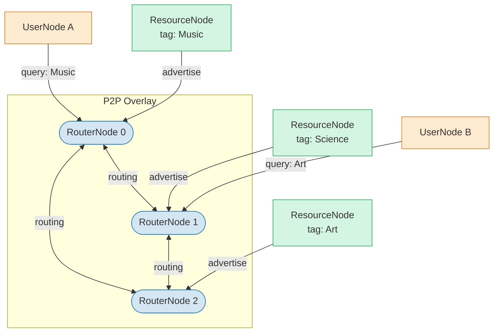
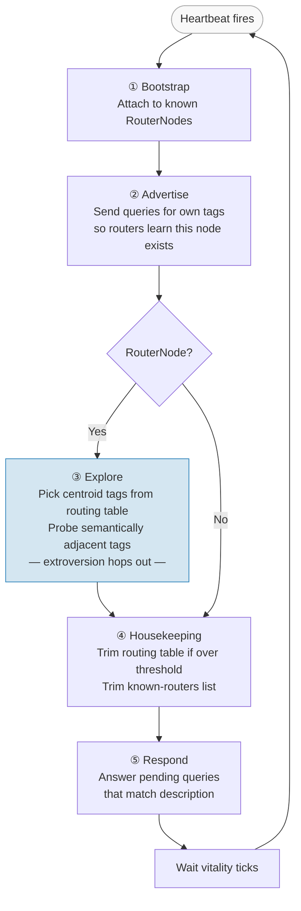
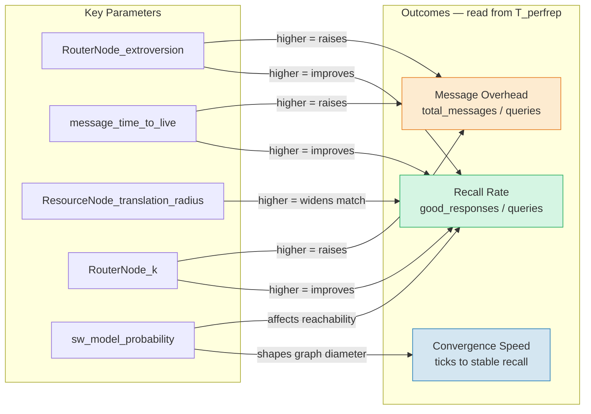
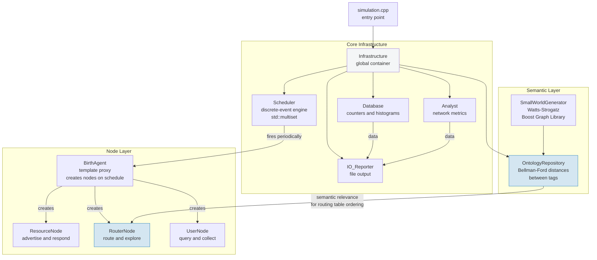

# SRN — Semantic Routing Network Simulator

A C++ discrete-event simulator for peer-to-peer networks that use **semantic
ontologies** to route resource-discovery queries without a central directory.
Rather than routing by address or keyword equality, nodes learn which neighbours
are semantically relevant and forward queries toward the best match.

---

## What is being simulated?

Imagine a peer-to-peer network where:

- **Resources** (files, services) are labelled with *tags* drawn from a shared
  vocabulary of 40 words.
- **Routers** don't know the full network; they maintain compact *routing
  tables* that map tags to nearby nodes that know about resources with those
  tags.
- **Users** issue queries for a tag and expect to be routed, hop-by-hop, to a
  matching resource — without any central index.

The novelty is that tags are not opaque identifiers.  They live in a
**small-world semantic graph** (Watts-Strogatz model), so tag 3 and tag 5 can
be "semantically close" even if they are numerically different.  Routing uses
this graph distance: a router that knows about tag 5 resources is also a
reasonable next hop for a tag 3 query, because the resource may be able to
translate or generalise.

The simulation asks: *does this decentralised, semantics-aware routing
self-organise into a network that can satisfy user queries at acceptable
overhead?*



---

## Protocol lifecycle (one node's life)

Every node runs on a repeating heartbeat timer.  Each heartbeat goes through
these phases in order:

**ResourceNodes** advertise their description tags and answer matching queries.

**RouterNodes** additionally run an *exploration* phase: they pick centroid tags
from their current routing table, fan out to semantically adjacent tags
(controlled by `RouterNode_extroversion`), and issue discovery queries to pull
in new resource and router entries.  This is how the routing table fills over
time without any central authority.

**UserNodes** join late (configurable via `Birth_UserNode_start_time`), attach
to a few routers, and then periodically submit queries.  A good response is one
that reaches a ResourceNode whose description matches the query tag.



---

## Building

```bash
make          # produces the 'simulation' binary
make clean    # remove compiled objects
```

Compile-time feature flags (set in the Makefile `CFLAGS` line):

| Flag | Effect | Default |
|------|--------|---------|
| `DEBUG` / `DEBUG_L1` / `DEBUG_L2` | Increasingly verbose per-tick/event logging (slow) | off |
| `DUPPACK_CACHE` | Drop packets already seen (duplicate suppression) | on |
| `DETECT_LOOP` | Carry a visited-node list in each packet; drop loops | on |
| `SELECTIVE_PACKET_FILTER` | Additional redundant-forwarding filter | on |

---

## Running

```bash
./simulation config/config.dat        # run with a specific config
./simulation                          # prompts for config filename on stdin
```

The simulator writes all output to the current directory.  See
[RESULTS.md](RESULTS.md) for a detailed description of every output file.

### Build modes

The Makefile has two CFLAGS lines; only one is active at a time:

```makefile
# Release (default) — no debug output, full speed
CFLAGS=  -c -w -O2 -DDUPPACK_CACHE -DDETECT_LOOP -DSELECTIVE_PACKET_FILTER

# Debug — verbose per-tick/event logging, much slower
#CFLAGS=  -c -w -O2 -DDEBUG -DDEBUG_L1 -DDEBUG_L2 -DDUPPACK_CACHE -DDETECT_LOOP -DSELECTIVE_PACKET_FILTER -g
```

Switch between them with `make clean && make`.

### Live dashboard (viz.py)

Each heartbeat the simulator emits a JSON snapshot to **stderr**.
`viz.py` reads that stream and renders a live terminal dashboard using
[plotext](https://github.com/piccolomo/plotext) (installed automatically in
the dev container).

**Option 1 — see simulation progress *and* the dashboard simultaneously**
(recommended: process substitution keeps stdout visible):

```bash
./simulation config/config.dat 2> >(python3 viz.py)
```

**Option 2 — dashboard only** (stdout discarded):

```bash
./simulation config/config.dat 2>&1 >/dev/null | python3 viz.py
```

**Option 3 — save stream, watch in a second terminal**:

```bash
# Terminal 1
./simulation config/config.dat 2>viz_stream.jsonl

# Terminal 2
tail -f viz_stream.jsonl | python3 viz.py
```

**Replay a saved stream**:

```bash
python3 viz.py < viz_stream.jsonl
```

See [VISUALIZATION.md](VISUALIZATION.md) for the full design document
including all three visualization options.

Several ready-to-use config variants are included under `config/`:

| File | Description |
|------|-------------|
| `config/config.dat` | Default — small network, 202 ticks, good starting point |
| `config/configbig.dat` | Large network — more nodes, bigger routing tables |
| `config/config18.dat` / `config/config18big.dat` | Intermediate scale |
| `config/configv.dat` / `config/configv1-4.dat` | Vocabulary-size sweep variants |
| `config/configm.dat` | Minimal — short run, useful for quick sanity checks |
| `config/configu.dat` | User-node focused — larger user population |

---

## Configuration reference and what to experiment with

All parameters live in the `.dat` file.  Lines beginning with `#` are ignored.
Parameters can be given in any order.

### Simulation control

| Parameter | Default | What it does |
|-----------|---------|--------------|
| `run_for_ticks` | 202 | Total simulation duration. Increase to let routing tables fully converge. |
| `snapshot_reporter_period` | 40 | How often (in ticks) to write a full snapshot. Set to 1 for maximum time resolution. |
| `bootstrap_threashold` | 2 | Minimum number of RouterNodes that must exist before the network "opens". Prevents premature query flooding. |

### Message TTL

| Parameter | Default | What it does |
|-----------|---------|--------------|
| `message_time_to_live` | 5 | Max hops for internal routing messages (queries, responses between routers/resources). Too low → messages die before reaching a match; too high → excessive flooding. |
| `query_time_to_live` | 5 | Max hops for user-originated queries. Should be at least the expected diameter of the router subgraph. |

**Experiment:** Lower both TTL values and watch `Num_queries_dropped_for_TTL` rise in the `_perfrep` files while `Num_of_good_responses_for_UserNode` falls.

---

### ResourceNode behaviour

| Parameter | Default | Meaning / effect of changing |
|-----------|---------|------|
| `ResourceNode_vitality` | 10 | Heartbeat interval (ticks). Larger = less active, but lower overhead. |
| `ResourceNode_extroversion` | 3 | Number of routers the node advertises itself to each period. Higher = faster routing table population, more traffic. |
| `ResourceNode_delay` | 3 | Ticks before the node fires its first heartbeat. Staggers startup. |
| `ResourceNode_response_timeout` | 13 | How long the node waits for a response to its own queries. Must be ≥ round-trip latency (`delay × hops`), or listeners will time out early and you'll see `Num_reponses_dropped_when_no_active_listeners` warnings. |
| `ResourceNode_max_description` | 1 | Tags per resource. 1 = single-tag resources; increase for richer, multi-tag descriptions. |
| `ResourceNode_known_routers_floor` | 2 | Minimum routers to keep even when trimming. |
| `ResourceNode_known_routers_trim_threshold` | 3 | Triggers a trim when the list exceeds this. |
| `ResourceNode_known_routers_capacity` | 4 | Hard cap on known routers list. |
| `ResourceNode_translation_radius` | 1 | Semantic neighbourhood radius: a resource will respond to queries within this many hops on the ontology graph. Set to 0 for exact-match only. |

**Experiment:** Increase `ResourceNode_translation_radius` from 0 to 2 and measure how `Num_of_good_responses_for_UserNode` changes.  A larger radius makes recall easier but may introduce false positives.

---

### RouterNode behaviour

| Parameter | Default | Meaning / effect of changing |
|-----------|---------|------|
| `RouterNode_vitality` | 10 | Heartbeat interval. |
| `RouterNode_extroversion` | 1 | Semantic exploration radius: how many hops from a centroid tag the router will probe. The key knob for routing quality — see below. |
| `RouterNode_num_centroid_tags_to_explore_per_period` | 2 | How many centroid tags the router picks for exploration each heartbeat. Higher = faster table growth, more traffic. |
| `RouterNode_num_exploration_queries_to_submit_per_period` | 5 | Cap on exploration queries per period. Limits bandwidth used by discovery. |
| `RouterNode_delay` | 3 | Startup delay. |
| `RouterNode_response_timeout` | 13 | Must be ≥ round-trip latency. |
| `RouterNode_k` | 3 | Top-k forwarding: how many routing table entries to forward a query to. Higher k → better recall, more traffic. |
| `RouterNode_duplicate_message_cache_timeout` | 10 | Ticks to remember a seen packet ID. Longer = fewer duplicates processed; uses more memory. |
| `RouterNode_max_description` | 2 | Max tags per router description. |
| `RouterNode_routing_table_length_floor` | 3 | Min tag-rows to keep after trimming. |
| `RouterNode_routing_table_length_trim_threshold` | 4 | Trigger for length trimming. |
| `RouterNode_routing_table_max_length` | 5 | Hard cap on tag-rows. |
| `RouterNode_routing_table_width_floor` | 3 | Min entries per row after trimming. |
| `RouterNode_routing_table_width_threshold` | 4 | Trigger for width trimming. |
| `RouterNode_routing_table_min_num_resource_nodes` | 2 | Width trimming won't remove resource-node entries until at least this many remain per row. Ensures resources are not evicted before routers. |
| `RouterNode_routing_table_max_width` | 4 | Hard cap on entries per row. |

**`RouterNode_extroversion` is the single most impactful knob.**  At `1` the
router only explores tags directly adjacent in the ontology; resources whose
tag is two hops away may never be discovered.  At `3` the router sweeps a much
wider semantic neighbourhood.  The comment in `config/config.dat` notes that a value
of `1` fails to recall resources with certain tags.

**Experiment — recall vs overhead:**

```bash
# baseline
RouterNode_extroversion 1
# high recall
RouterNode_extroversion 3
```

Compare `Num_of_good_responses_for_UserNode` and `Num_total_message_generated`
across the two runs.  This is the fundamental recall/overhead trade-off.

---

### UserNode behaviour

| Parameter | Default | Meaning |
|-----------|---------|---------|
| `UserNode_vitality` | 20 | Heartbeat interval (how often a user submits a new batch of queries). |
| `UserNode_extroversion` | 3 | Number of RouterNodes the user attaches to. More = more entry points into the overlay, better recall but more traffic. |
| `UserNode_response_timeout` | 10 | Must be ≥ network latency for user queries. |
| `UserNode_num_queries_to_submit_per_period` | 5 | Queries per heartbeat. The load on the network. |

---

### Birth agents (node arrival schedule)

Each node type has its own birth agent that fires periodically and creates
nodes in batches.

| Parameter | Meaning |
|-----------|---------|
| `Birth_*Node_start_time` | Tick at which the first batch is created. UserNodes should start after routers are established. |
| `Birth_*Node_period` | Ticks between batches. |
| `Birth_*Node_total_num_cycles` | Total batches before the birth agent stops. |
| `Birth_*Node_num_cycles_per_heartbeat` | Nodes created per batch (burst size). |

**Experiment — churn / late arrivals:**  Set `Birth_ResourceNode_period` to a
large value so resources arrive slowly, and observe whether routing tables
adapt.

---

### Ontology (semantic graph)

| Parameter | Default | Meaning |
|-----------|---------|---------|
| `num_words` | 40 | Vocabulary size — number of tags. Larger vocabularies require bigger routing tables. |
| `degree_of_associativity_of_words` | 4 | Average degree of each word node in the ontology graph. Higher = denser semantic connections. |
| `sw_model_probability` | 0.7 | Watts-Strogatz rewiring probability. `0.0` = regular ring lattice (high clustering, high diameter); `1.0` = random graph (low diameter, low clustering). Values around `0.1–0.3` give the small-world regime. |

**Experiment — ontology structure:** compare `configm.dat` (p=0.02, near-lattice)
with `config/config.dat` (p=0.7, near-random).  The `0_ontorep` file reports the
ontology diameter — a key input to choosing TTL values.

---

### Response timeout rule of thumb

```
response_timeout  ≥  delay  ×  (message_time_to_live + 1)
```

If this is violated the node's listener will time out before all responses
arrive and you will see `May be an error` messages in stdout plus elevated
`Num_reponses_dropped_when_no_active_listeners` counts.

---

## Key metrics to watch

Open the `T_perfrep` files at increasing T and track these ratios:

```
User recall rate  =  Num_of_good_responses_for_UserNode
                     ─────────────────────────────────
                     Queries_sent_from_UserNode

Message overhead  =  Num_total_message_generated_for_UserNode
                     ────────────────────────────────────────
                     Queries_sent_from_UserNode
```

A well-tuned simulation shows recall increasing over time (as routing tables
fill in) while overhead stabilises or falls.  A poorly tuned one shows
high overhead with flat or declining recall (TTL too low, extroversion too low,
or tables too small).

The diagram below shows which parameters most directly drive which outcomes:



---

## Architecture



Key design patterns: event-driven scheduling, template proxy (`BirthAgent<T>`),
observer (`Listener`), and compile-time feature flags.

---

## Technologies

- **Language**: C++ (C++98/03 compatible source, builds under GCC 11+ with minor fixes)
- **Compiler**: `g++34` (symlink to system g++)
- **Build**: GNU Make
- **Libraries**: Boost Graph Library (small-world generation, Bellman-Ford), STL

---

## Output files

See [RESULTS.md](RESULTS.md) for a full description of every output file format.

Snapshot files are prefixed with the tick number (e.g. `41_perfrep`):

| File | Content |
|------|---------|
| `T_netout.net` | Pajek-format network topology — load in Gephi or NetworkX |
| `T_netroutingtable` | Full routing table contents per RouterNode |
| `T_netstrucrep` | Structural metrics: diameter, distance histogram, routing table histograms |
| `T_perfrep` | Performance counters: recall, drops, overhead |
| `0_ontoout.net` | Semantic ontology graph (Pajek) |
| `0_ontorep` | Ontology diameter and distance matrix |
